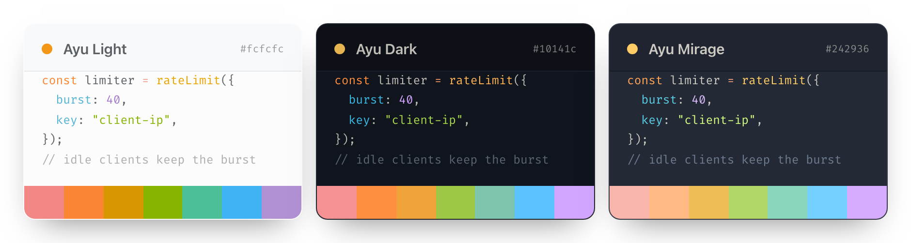
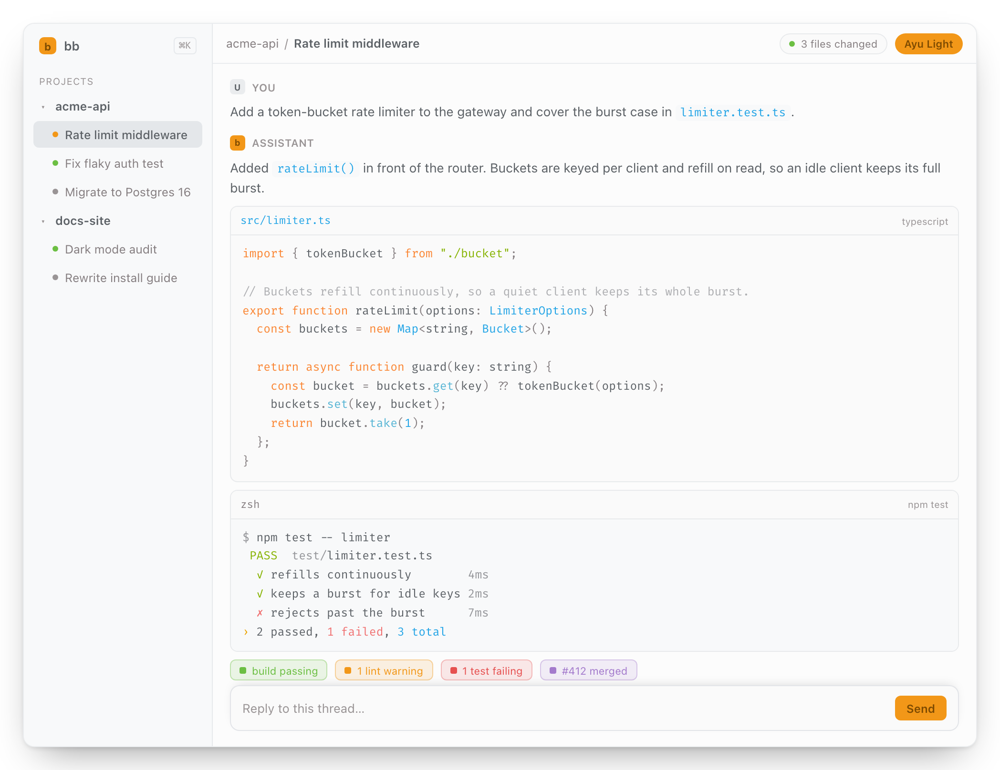
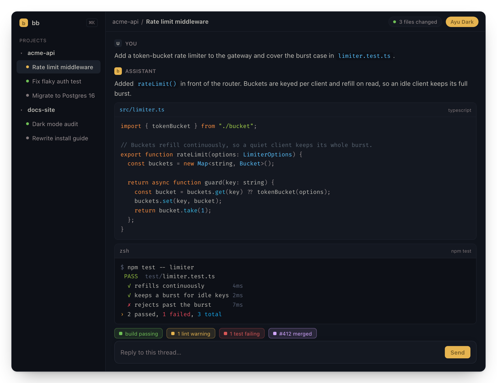
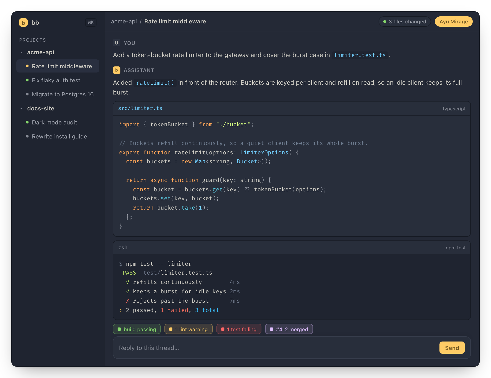
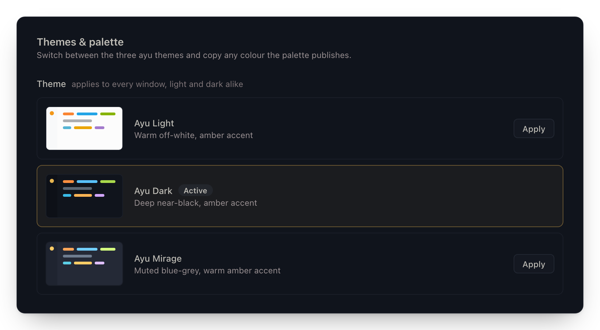
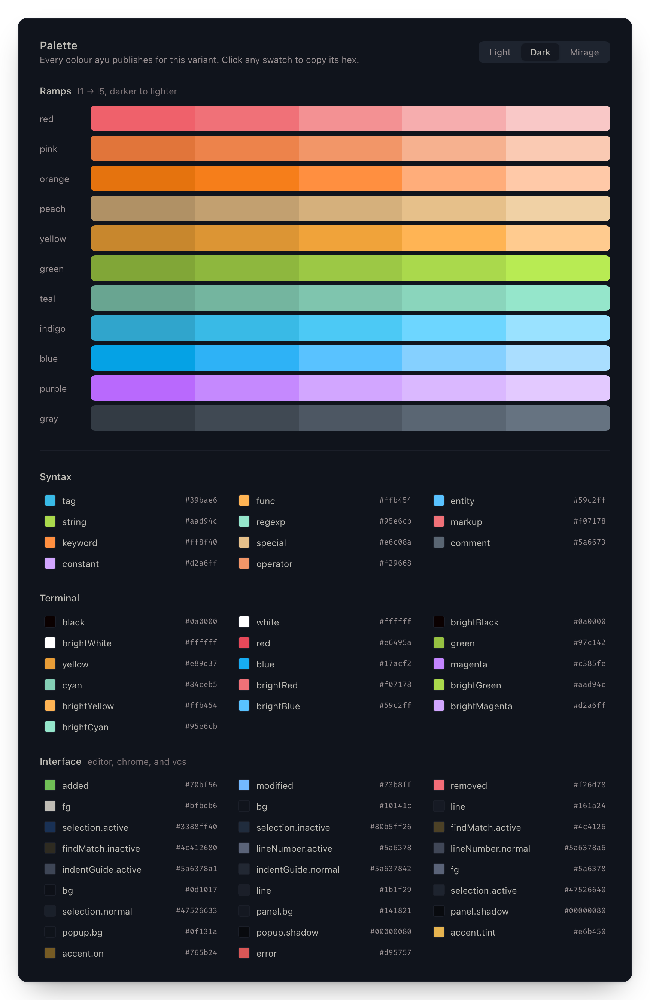
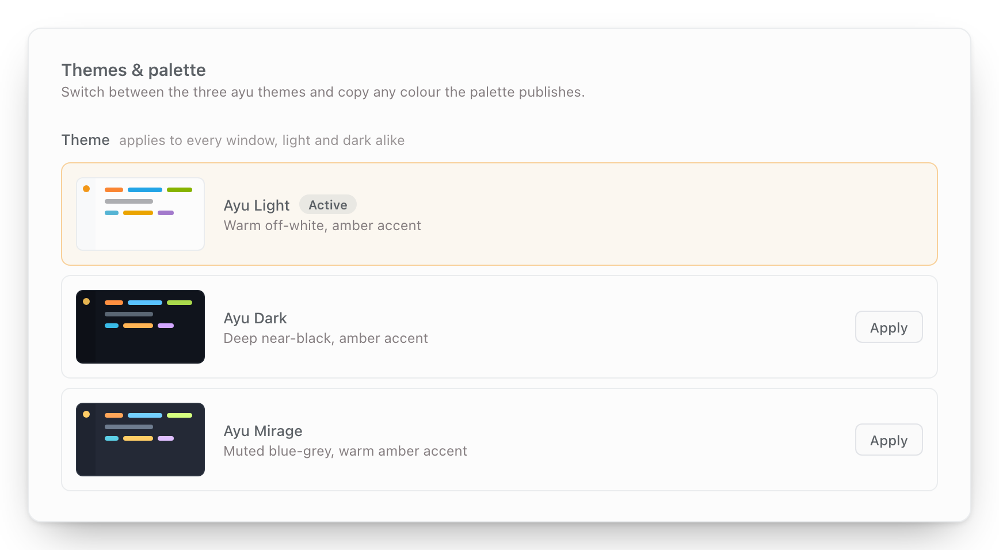
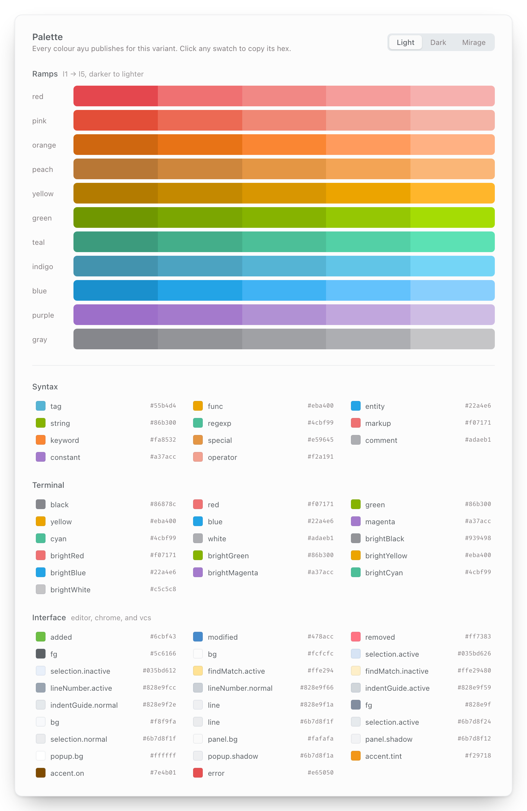
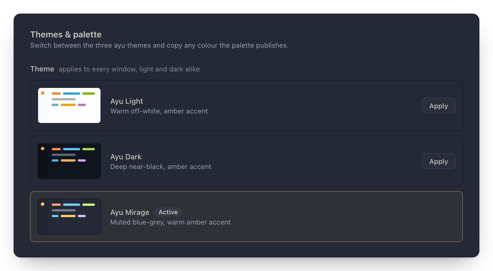
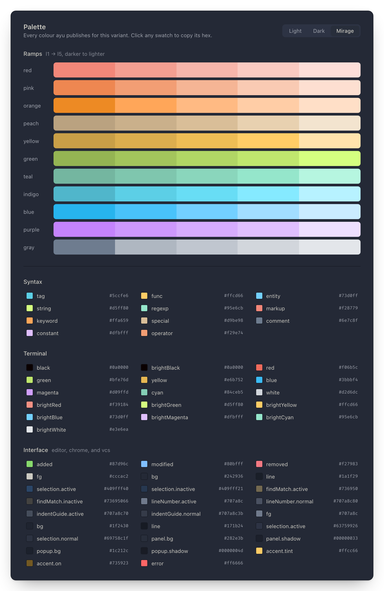

# bb-plugin-ayu

The three [ayu](https://github.com/ayu-theme/ayu-colors) themes for BB — Light,
Dark, and Mirage — with a palette explorer panel and a `bb ayu` colour lookup.



## Install

```
bb plugin install git:https://github.com/vburojevic/bb-plugin-ayu.git
```

Then pick a theme under Settings → Appearance, or `bb theme set
plugin:ayu:ayu-dark`.

## The three themes

Each variant is a whole theme, the way ayu ships them everywhere else: one
stylesheet paints both of BB's modes, so selecting Ayu Dark gives you Ayu Dark
whichever way the light/dark switch is set.

```
bb theme set plugin:ayu:ayu-light
bb theme set plugin:ayu:ayu-dark
bb theme set plugin:ayu:ayu-mirage
```

### Ayu Light

Warm off-white, amber accent. A low-contrast palette by design.



### Ayu Dark

Deep near-black, amber accent.



### Ayu Mirage

Muted blue-grey, warm amber accent.



## The Ayu panel

Settings → Ayu switches themes with live miniature previews drawn from each
palette. The panel tracks theme changes from other windows in realtime.



Below the switcher sits every colour ayu publishes for the selected variant —
ramps, syntax, terminal, interface. Click any swatch to copy its hex.



<details>
<summary>The same panel in Ayu Light and Ayu Mirage</summary>









</details>

## `bb ayu`

For agents and scripts:

```
bb ayu themes                  # the three themes and the command that activates each
bb ayu colors light syntax     # resolved colours, filterable, --json available
```

## Architecture

```
scripts/generate-themes.mjs   the single source of truth: upstream `ayu` npm
                              package -> themes/*.css + generated/palettes.ts
themes/*.css                  generated BB stylesheets (do not edit)
generated/palettes.ts         generated resolved palettes (do not edit)
themes-meta.ts                plain shared data (theme ids/names/variants)
server.ts                     rpc (active theme, switch via bb.sdk.theme),
                              realtime signal, `bb ayu` CLI
app.tsx                       the Settings-page panel, vendored shadcn components
scripts/generate-screenshots.mjs   the README images, rendered from the above
```

Palette data never crosses rpc — `generated/palettes.ts` is a plain module the
frontend bundles directly. Only the active-theme read and the switch go through
the backend, which uses `bb.sdk.theme.set()` (the same server API the Settings
page uses) and publishes a `theme-changed` realtime signal so every open panel
stays in sync.

## How the palette maps onto BB tokens

**Ayu and BB stack their surfaces in opposite directions, and that governs the
whole mapping.**

Ayu names three surfaces: `surface.base` (window chrome — sidebar, status bar),
`surface.lift` (the editor), and `ui.panel`/`ui.popup` on top. Base is the
*darkest*; the editor sits lifted above it.

BB has one anchor, `--canvas`, and derives everything else by mixing in `--ink`.
Every derivation moves *away* from canvas — including the sidebar, which is
always a step lighter. `--background`, `--card` and `--popover` are all plain
`var(--canvas)`.

So `--canvas` is ayu's **`surface.lift`**, not `surface.base`. Anchoring on base
inverts the hierarchy (sidebar renders lighter than content) and flattens the
app into one tone. The surfaces ayu places below or above the editor are set
explicitly:

| BB | ayu | vscode-ayu equivalent |
| --- | --- | --- |
| `--canvas` (⇒ `--background`) | `editor.bg` (`surface.lift`) | `editor.background` |
| `--sidebar` | `ui.bg` (`surface.base`) | `sideBar` / `statusBar` / `activityBar.background` |
| `--card`, `--surface-raised*` | `ui.panel.bg` | `dropdown.background`, `editorWidget.background` |
| `--popover` | `ui.popup.bg` | `menu.background` |
| `--secondary`, `--accent`, `--muted` | `ui.selection.*` | `list.hoverBackground` |
| `--surface-recessed*` | `ui.bg` (`surface.base`) | — |
| `--border*`, `--sidebar-border` | `ui.line` | `panel.border`, `sideBar.border` |
| `--input` | `ui.fg` @ 20% | `input.border` |
| `--state-hover` / `--state-active` | `ui.selection.*` | `list.hoverBackground` |
| `--surface-selected` | `ui.selection.active` | `list.activeSelectionBackground` |
| `--primary` / `--primary-foreground` | `common.accent.tint` / `.on` | `button.background` / `.foreground` |
| `--file-accent` | `syntax.entity` | — |
| `--destructive`, `--destructive-text` | `common.error` | `errorForeground` |
| `--warning`, `--attention` | `common.accent.tint` | `editorWarning.foreground` |
| `--success`, `--diff-*` | `vcs.*` | `gitDecoration.*ResourceForeground` |
| `--ansi-0…15` | `terminal.*` | `terminal.ansi*` |

Two derived-fill traps worth knowing:

- `--surface-selected` defaults to solid `var(--primary)` — left alone, every
  selected row is a block of amber. Ayu selects with a neutral wash.
- BB builds neutral fills by mixing `--ink` into `--canvas`, and ayu's ink is a
  **warm** grey while its surfaces are cool navy — derived chips and wells come
  out tan (measured `#282225` against a `#10141c` app). The fills are set from
  `ui.selection` and `surface.base` instead.

### Syntax highlighting

BB highlights chat code blocks with
[sugar-high](https://github.com/huozhi/sugar-high), whose tokens read their
colour from `--sh-*` custom properties:

| sugar-high | ayu | |
| --- | --- | --- |
| `--sh-keyword` | `syntax.keyword` | `if`, `return`, `const` |
| `--sh-string` | `syntax.string` | |
| `--sh-comment` | `syntax.comment` | |
| `--sh-class` | `syntax.entity` | ayu: "class names, types, modules" |
| `--sh-entity` | `syntax.func` | ayu: "function names and calls" |
| `--sh-property` | `syntax.tag` | |
| `--sh-jsxliterals` | `syntax.tag` | JSX element names |

BB declares these **on `.bb-code-highlight` itself**, not on `:root`, so they
must be overridden at element level — a `:root` block silently loses. The
generated selector repeats `.dark .bb-code-highlight` to outrank BB's dark
override at equal specificity (this stylesheet is injected last).

`--sh-identifier`, `--sh-sign` and `--sh-space` are deliberately left to BB:
they already resolve to ayu's `editor.fg` and a dimmed tier of it, and
sugar-high's `sign` covers *all* punctuation — ayu's salmon operator colour
there would tint every bracket and comma.

BB's Shiki-based diff viewer picks its theme in JS and is not reachable from a
theme stylesheet, though BB bundles Shiki's ayu themes already.

### What is *not* taken from ayu

**The three secondary text tiers.** BB's own sit close to `--ink` (78% / 71.5% /
68% mixes) because `--muted-foreground` carries a lot of ordinary secondary
text; ayu's `ui.fg` is a tab-label colour, far too dim for that role. The tiers
follow BB's anchor-derived recipe and pick the palette's hue up through `--ink`
and `--canvas`.

**ANSI bright black on the dark variants**, where ayu 9 sets both black and
bright black to near-black. Bright black is what dim terminal output is drawn
in, so it falls back to `ui.fg` — the same substitution vscode-ayu makes.

Everything else is a colour ayu publishes. Nothing is blended, darkened, or
contrast-corrected: Ayu Light is a low-contrast palette by design, and "fixing"
it produces muddy off-palette browns instead of ayu.

## Developing

```
npm install
npm run generate        # regenerate themes/ + generated/ from the ayu package
npm run screenshots     # regenerate assets/screenshots/ from themes/ + generated/
npm run typecheck
bb plugin build         # bundle app.tsx -> dist/
bb plugin install .     # or: bb plugin dev  (watch loop)
```

UI components under `components/ui/` are vendored from the BB registry (shadcn
model) — add more with `npx shadcn@latest add @bb/<name>`.

### About the screenshots

They are rendered, not captured from a running BB. `npm run screenshots` loads
`themes/<id>.css` verbatim into a headless Chromium page over a small base layer
that reproduces the token derivations BB performs but this plugin leaves alone
(`--foreground`, `--ring`, the `--sh-*` defaults), then screenshots it at 2x. The
code block is highlighted by sugar-high — the same library BB uses — so the
`--sh-*` mapping above is exercised for real.

Every colour in the images is therefore a colour the plugin actually ships, and
regenerating after a palette change keeps them honest. The window layout is a
stand-in for BB's chrome; the content is invented. Nothing comes from anyone's
BB instance.

Colours are MIT-licensed by the ayu project (Ike Ku / Konstantin Pschera).

---

## Fork provenance

Rift Labs fork: https://github.com/euforicio/rift-plugin-ayu
Upstream: https://github.com/vburojevic/bb-plugin-ayu

## More bb plugins

See every bb plugin I publish at
[**vburojevic/bb-plugins**](https://github.com/vburojevic/bb-plugins).
